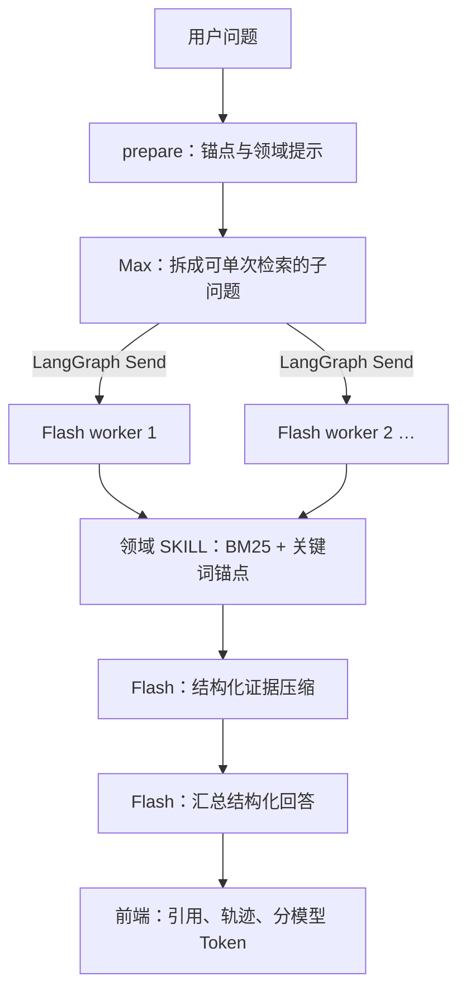

# 金融文档问答 Agent

天池 AFAC 2026 赛道四：金融长文本问答挑战参赛项目

题目涉及年报、债券募集说明书、保险条款、监管法规和行业研报。系统要先找到对应文档，再从长文本里找齐证据，完成条款核验、跨文档比较或计算，最后输出带来源的结构化答案。检索不使用 embedding 或向量数据库，采用 BM25 和关键词锚点。

竞赛 B 榜得分 **93.11**，排名 **18**，榜单最高分 **93.50**。

## 为什么保留两个版本

竞赛时，我把精力放在准确率上：增加领域规则、证据窗口、补检索和答案一致性检查。分数提高后，代码也逐渐变得难解释。一次问题走哪条路径、为什么补检索、哪些规则影响了结果，都需要翻很多文件。

赛后我重新写了一版，暂时不追求分数，先把 Agent 的行为整理清楚：Max 拆问题，Flash 选择领域工具并提取证据，LangGraph 管理状态和并行 worker，前端展示调用轨迹和模型 Token。新版本只读取相同的数据，没有复用竞赛版的实现代码。

| | 竞赛提交版 | 赛后重构版 |
|---|---|---|
| 主要目标 | 准确率、预算和可复现提交 | 清晰的 Agent 架构与可观测流程 |
| 代码入口 | `src/finqa_agent/` | `financial_qa_agent/app/` |
| 编排 | 自定义多角色流程、动态检索与裁决 | LangGraph Planner–Worker 状态图 |
| 模型 | 固定 Qwen3.7-Max 快照 | Max 规划；Flash 检索选择、压缩与最终回答 |
| 计算 | 模型生成计算程序，受限 AST 执行，再审计 | 提供独立计算工具；当前主图尚未自动接入 |
| 验证口径 | 竞赛成绩与全量运行记录 | 流程完成、结构合法、轨迹可见；不宣称同等准确率 |

## 先跑一个不需要密钥的 Demo

仓库自带五份很小的合成文档，默认读取这些样例。它们不是比赛数据，也不能用于评估模型准确率。

Python 3.11+，在仓库根目录执行：

```powershell
cd financial_qa_agent
python -m venv .venv
.\.venv\Scripts\python.exe -m pip install -e ".[dev]"
Copy-Item .env.example .env
.\.venv\Scripts\python.exe -m uvicorn app.main:app --port 8000
```

Linux / macOS：

```bash
cd financial_qa_agent
python3 -m venv .venv
.venv/bin/python -m pip install -e '.[dev]'
cp .env.example .env
.venv/bin/python -m uvicorn app.main:app --port 8000
```

打开 <http://127.0.0.1:8000>，试问：

- 示例文件的营业收入是多少？
- 安心保险的等待期是多久？
- 示例合同的债券期限是多少？

页面会展示 `prepare → decompose → worker → finalize` 的轨迹、检索工具的输入输出、证据引用和结构化答案。详情可折叠。演示模式不调用模型，Token 为零；真实模型模式按服务返回的 usage 统计。展示的是公开执行摘要，不是模型的私有思维链。

使用真实模型时，将 `.env` 中的 `FINQA_DEMO_MODE` 改为 `false`，填写 `OPENAI_API_KEY`、OpenAI-compatible 服务地址和账号实际可用的模型名。密钥只放本地，前端不接收密钥。模型名称是否可用以服务账号为准，不保证每个账号都能访问示例快照。

## 重构版怎么工作



索引采用两层 overlap：检索当前页时附带上一页尾部和下一页头部；页内再滑动切块。这样能减少分页边缘的漏检，但固定字符 overlap 仍不能保证整张表格完整。具体状态、检索锚点和领域路由见 [架构说明](docs/architecture.md)。

## 我在这个项目里的几个判断

公司名、年份、指标、数字和条款原文是金融题里的强信号，所以我先选择词法检索。这个选择降低了部署成本，也便于解释为什么召回某一页。它的代价是对别名、改写和隐含关系不够稳，不能据此说向量检索一定更差。

最让我意外的是“找到正确页面”和“拿到足够证据”之间的差距。一次年报题已经命中目标页，进入模型的片段却在目标行之前截断了；另一次，其他选项已经找到营业收入，计算选项的独立上下文仍然缺这个分母。问题不总在模型，而在证据怎么组织和共享。[真实 badcase](docs/bad-cases.md) 记录了这些失败，也区分了已实现的改动和待验证的方案。

我保留了竞赛版，因为它能说明分数是怎么来的；我更愿意继续维护重构版，因为它的状态、工具边界和失败位置更容易解释。下一步想先补题级事实共享、表格边界和计算节点，而不是继续堆题型规则。没有做过的消融和生产能力不会写成已完成。

## 结果与边界

根据提交报告，竞赛版的一次 100 题全量运行使用 4 workers，完成 248 次 API 调用；推理阶段耗时 24 分 14.296 秒，总 Token 为 572,805（输入 540,656，输出 32,149）。耗时从索引就绪后开始，不含解析时间。API 调用成功率 100% 不等于答题准确率 100%。这些是历史单次运行数据，不是本公开版本重新测得的性能保证。

重构版目前仍是原型：没有持久化 checkpointer、登录鉴权、多租户隔离或完备的超时恢复；结构化失败时可能返回证据摘要兜底。相邻页片段会沿用中心页的引用标签，严格页级引用还需要更细的来源跨度。不要把页面的置信标签当成经过校准的概率，也不要将答案用于投资或合规决策。

## 目录与阅读顺序

```text
financial_qa_agent/       # 独立重构版：状态图、领域 SKILL、前端、合成样例
src/finqa_agent/          # 竞赛版：检索、推理、计算、审计
src/preprocess/           # PDF / TXT / HTML 解析与标准化
config/                  # 竞赛配置
scripts/                 # 竞赛复现、审计与历史辅助工具
tests/                   # 竞赛版回归测试
docs/                    # 架构、设计取舍、真实失败分析、复现说明
.github/workflows/       # 不使用密钥或比赛数据的 CI
```

建议先读 [重构版架构](docs/architecture.md)，再看 [设计笔记](docs/design-notes.md) 和 [失败分析](docs/bad-cases.md)。想复现原始比赛流程，可读 [竞赛复现说明](docs/competition-reproduction.md)。

## 测试与数据

```powershell
# 重构版（在 financial_qa_agent 目录）
.\.venv\Scripts\python.exe -m pytest
node --check app/web/static/app.js
.\.venv\Scripts\python.exe scripts/evaluate_ground_truth.py --mode agent --ground-truth tests/fixtures/ground_truth.json

# 竞赛版（另建虚拟环境，在仓库根目录）
python -m pip install -r requirements.txt
python -m unittest discover -s tests -v
python scripts/audit_public_release.py
```

两套依赖分别安装，避免把 Demo 变成必须安装 PDF 处理依赖的工程。CI 只使用合成 fixture，不发送付费模型请求。真实 B 榜题库可以通过 `--ground-truth` 指定，在有合法数据授权时本地运行；默认公开样例的流程成功不代表真实模型的准确率。本次检查结果见 [公开版验证记录](docs/release-checks.md)。

原始文档、题库与标注、答案 CSV、API 日志、索引、虚拟环境及密钥不在仓库中。数据准备和使用边界见 [数据说明](docs/data-and-usage.md)。本次发布不附带旧仓库的 Git 历史。
