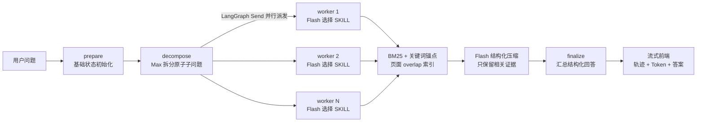

# 金融文档问答 Agent：LangGraph 封装与交互工程

本目录提供金融文档问答 Agent 的 LangGraph 封装、领域检索工具与交互前端。默认读取 `tests/fixtures/corpus` 中的合成文档；真实数据通过 `FINQA_DATA_ROOT` 显式配置。项目背景、比赛效果与技术方案见 [仓库首页](../README.md)。

实现要点：

- 不使用 embedding 或向量数据库，检索采用 BM25、关键词锚点和标题/年份/短语加权。
- Max 模型负责把原始问题拆成 1～6 个可由单次检索回答的原子子问题。
- 每个子问题由 Flash 模型选择一个领域 SKILL、执行检索，并将结果压缩为结构化证据。
- LangGraph 显式维护状态，并通过 `Send` 并行派发子问题 worker。
- 前端通过 NDJSON 流展示公开的执行轨迹、工具输入输出摘要和各模型 token 用量。
- 页面不会展示模型私有思维链，只展示可审计的节点、调用理由、检索结果和结构化中间产物。

## 架构



## Agent State

状态定义位于 `app/agent/state.py`。

| 字段 | 类型 | 更新方式 | 用途 |
|---|---|---|---|
| `question` | `str` | 初始写入 | 用户原始问题 |
| `subquestions` | `list[SubQuestion]` | `decompose` 覆盖 | Max 生成的原子子问题 |
| `subquestion` | `SubQuestion` | `Send` 写入 | 当前 worker 处理的子问题 |
| `subquestion_results` | `list[dict]` | `operator.add` reducer | 各 Flash worker 的结构化结果 |
| `token_usage` | `list[dict]` | `operator.add` reducer | 每次模型调用的模型名、输入/输出/总 token |
| `evidence` | `list[dict]` | `operator.add` reducer | 检索命中的原始证据 |
| `calculations` | `list[dict]` | `operator.add` reducer | 计算工具的表达式与结果 |
| `trace` | `list[dict]` | `operator.add` reducer | 可在前端展示的公开执行轨迹 |
| `final_answer` | `StructuredAnswer` | `finalize` 写入 | 结构化最终回答 |
| `error` | `str \| None` | 异常时写入 | 可恢复错误信息 |

`subquestion_results` 和 `token_usage` 使用 reducer，是因为多个 worker 可能并行返回。Max 的拆分通过 tool calling 提交结构化参数；Flash 每个子问题只调用一个检索 SKILL，随后再次调用 Flash 进行证据压缩。若模型未保留任何证据，系统会保留 BM25 排名前三的命中作为可审计兜底。

## 领域 SKILL 与工具

| SKILL | Tool | 数据子目录 |
|---|---|---|
| 财报 | `search_financial_reports` | `financial_reports/` |
| 金融合同 | `search_financial_contracts` | `financial_contracts/` |
| 保险 | `search_insurance_documents` | `insurance/` |
| 监管 | `search_regulatory_documents` | `regulatory/` |
| 研究报告 | `search_research_reports` | `research/` |
| 计算 | `calculate_finance` | 无；安全 AST 算术 |

当前主图只调用领域检索工具。计算工具已经定义并有单元测试，但尚未自动接入 worker/finalize。SKILL 是本工程内的领域工具封装，运行时通过 Python 工厂注册，不是任意外部 SKILL 的动态加载系统。

每个领域都有独立 `SKILL.md` 和检索工具入口。检索工具返回统一的 `SearchHit`，包含文档、页码、原文、BM25 分数与命中的关键词锚点。

## 页面 overlap 索引

运行针对性预处理脚本：

```powershell
python scripts/build_page_index.py
```

脚本将索引写入 `runtime_index/`。每一页的检索文本由“上一页尾部 + 当前页 + 下一页头部”组成，跨页 overlap 长度由 `FINQA_PAGE_OVERLAP` 控制；页内再按 `FINQA_CHUNK_SIZE` 和 `FINQA_CHUNK_OVERLAP` 滑动切块。这能减少边缘漏检，但不保证表格闭包完整。重叠片段目前引用中心页，严格来源跨度仍待完善。`manifest.json` 记录构建参数，配置不匹配时运行时会忽略旧索引并从原始数据重建。数据变化后应重新执行脚本。

## 安装与运行

要求 Python 3.11+。建议始终使用项目虚拟环境，避免系统 Python 缺少 `uvicorn`：

```powershell
python -m venv .venv
.\.venv\Scripts\python.exe -m pip install -e ".[dev]"
Copy-Item .env.example .env
.\.venv\Scripts\python.exe scripts\build_page_index.py
.\.venv\Scripts\python.exe -m uvicorn app.main:app --reload --port 8000
```

打开 `http://127.0.0.1:8000/`。

模型配置示例：

```dotenv
FINQA_PLANNER_MODEL=qwen3.7-max
FINQA_TOOL_MODEL=qwen3.7-flash
FINQA_PAGE_OVERLAP=240
FINQA_TOP_K=10
FINQA_REQUEST_TIMEOUT=120
```

没有 API Key 或设置 `FINQA_DEMO_MODE=true` 时进入确定性的演示模式，只验证完整流程，不以准确率作为目标。

## API 与前端事件

- `GET /api/health`：服务和数据目录状态。
- `GET /api/meta`：运行模式、Max/Flash 模型、领域和检索配置。
- `POST /api/chat/stream`：请求体为 `{"question":"..."}`，返回逐行 NDJSON。

流事件包括 `status`、`trace`、`token_usage`、`answer`、`done` 和 `error`。`token_usage` 按模型累计展示输入 token、输出 token、总 token 与调用次数；数值来自模型服务返回的 usage 元数据。轨迹只包含公开的工具选择理由、输入和结果摘要，不包含私有思维链。

## 测试

```powershell
.\.venv\Scripts\python.exe -m pytest -q
node --check app\web\static\app.js
```

合成样例流程验收（默认五题，不是比赛数据）：

```powershell
# 合成 fixture 的流程测试，不调用模型，不以准确率为门槛
$env:FINQA_DEMO_MODE="true"
.\.venv\Scripts\python.exe scripts\evaluate_ground_truth.py --mode agent --ground-truth tests/fixtures/ground_truth.json --output evaluation_agent_flow_all.json

# 对自己持有合法授权的外部题库，使用当前模型配置跑指定题目
$env:FINQA_DEMO_MODE="false"
.\.venv\Scripts\python.exe scripts\evaluate_ground_truth.py --mode agent --ground-truth /path/to/authorized_questions.json --qid your-question-id
```

流程验收标准为题目完成 `prepare → decompose → worker → finalize → structured answer` 且无运行错误。合成演示用于验证运行流程，真实模型准确率需另行评测。
